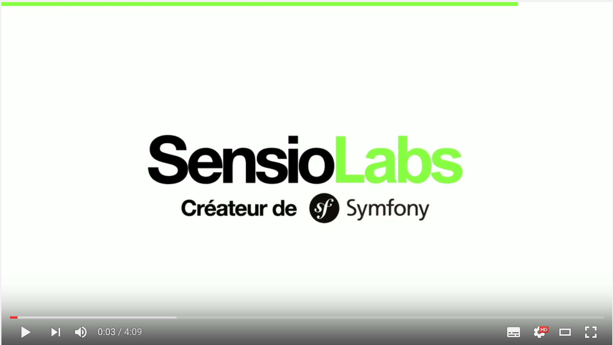
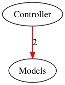

# Deptrac

[](https://travis-ci.org/sensiolabs-de/deptrac)

## What is Deptrac

Deptrac is a static code analysis tool that helps to enforce rules for dependencies between software layers.

For example, you can define a rule like "controllers may not depend on models".
To ensure this, deptrac analyzes your code to find any usages of models in your controllers and will show you where
this rule was violated.


## Table of Contents

1. [Introduction Video](#introduction-video)
1. [Getting Started](#getting-started)
  1. [The depfile](#the-depfile)
  1. [Explanation](#explanation)
1. [Installation](#installation)
  1. [Download the phar (recommended)](#download-the-phar-recommended)
  1. [Optional dependency: Graphviz](#optional-dependency-graphviz)
1. [Run Deptrac](#run-deptrac)
1. [Layers](#layers)
  1. [Collecting Layers](#collecting-layers)
1. [Violations](#violations)
1. [Ruleset (allowing dependencies)](#ruleset-allowing-dependencies)
1. [Different layers and different views](#different-layers-and-different-views)
1. [Collectors](#collectors)
  1. [`className` Collector](#classname-collector)
  1. [`bool` Collector](#bool-collector)
  1. [More collectors](#more-collectors)
1. [Formatters](#formatters)
  1. [Console formatter](#console-formatter)
  1. [Graphviz Formatter](#graphviz-formatter)
1. [Build deptrac](#build-deptrac)
1. [Contribute](#contribute)

## Introduction Video

[](https://www.youtube.com/watch?v=T5oWc4ujmOo)

## Getting Started

The easiest way to get started is to download the [deptrac.phar](http://get.sensiolabs.de/deptrac.phar).

At first, you need a so called *depfile*, which is written in YAML.
You can generate a bootstrapped `depfile.yml` with

```bash
php deptrac.phar init
```

In this file you define (mainly) three things:

1. The location of your source code.
2. The layers of your application.
3. The allowed dependencies between your layers.


### The depfile

Let's have a look at the generated file:

```yaml
# depfile.yml
paths:
  - ./src
exclude_files:
  - .*test.*
layers:
  - name: Controller
    collectors:
      - type: className
        regex: .*Controller.*
  - name: Repository
    collectors:
      - type: className
        regex: .*Repository.*
  - name: Service
    collectors:
      - type: className
        regex: .*Service.*
ruleset:
  Controller:
    - Service
  Service:
    - Repository
  Repository: ~
```


#### Explanation

In the first section, `paths`, you declare where deptrac should look for your code.
As this is an array of directories, you can specify multiple locations.

With the `exclude_files` section, you can specify one or more regular expressions for files that should be excluded,
the most common being probably anything containing the "test" word in the path.

We defined three `layers` in the example: *Controller*, *Repository* and *Service*.
Deptrac is using so called `collectors` to group classes into `layers` (in this case by the name of the class).

The `ruleset` section defines, how these layers may or may not depend on other layers.
In the example, every class of the *Controller*-layer may depend on classes that reside in the *Service*-layer,
and classes in the *Service*-layer may depend on classes in the *Repository*-layer.

Classes in the *Repository*-layer may NOT depend on any classes in other layers.
The `ruleset` acts as a whitelist, therefore the *Repository*-layer rules can be omitted, however
explicitly stating that the layer may not depend on other layers is more declarative.

If a class in the *Repository*-layer uses a class in the *Service*-layer, deptrac wil recognize the dependency
and throws a violation for this case. The same counts if a *Service*-layer-class uses a *Controller*-layer-class.


## Installation

### Download the phar (recommended)

Download the [deptrac.phar](http://get.sensiolabs.de/deptrac.phar) and run it using `php deptrac.phar`.
Feel free to add it to your PATH (i.e. `/usr/local/bin/deptrac`)

```bash
curl -LS http://get.sensiolabs.de/deptrac.phar -o deptrac.phar

# optional
sudo chmod +x deptrac.phar
sudo mv deptrac.phar /usr/bin/local/deptrac
```

(In this guide, we assume, you have the [deptrac.phar](http://get.sensiolabs.de/deptrac.phar) in your project root)


### Optional dependency: Graphviz

If you want to create graphical diagrams with your class dependencies, you will also need the `dot` command provided by [Graphviz](http://www.graphviz.org/).
Graphviz can be install using common package managers:

```bash
# for osx + brew
brew install graphviz

# for ubuntu and debian
sudo apt-get install graphviz
```

Graphviz is also available for [Windows](http://www.graphviz.org/Download_windows.php): install the current stable release and append the binary path on the environment variable Path (like ``C:\Program Files (x86)\Graphviz2.38\bin``).


## Run Deptrac

To execute deptrac, run

```bash
php deptrac.phar

# which is equivalent to
php deptrac.phar analyze depfile.yml
```

If you run `php deptrac.phar -v` you'll get a more verbose output.


## Layers

Deptrac allows you to group different classes into *layers*.
Technically layers are nothing more than a collection of classes.

Each layer has a unique name and a list of one or more collectors, which will look for classes that should be assigned to this layer
(and yes, classes can be assigned to more than one layer).

(Hopefully) most software is written with some kind of layers in mind.
For example a typical MVC application has at least controllers, models and views.

Deptrac allows you to visualize and enforce rulesets, based on such layer information.

So, you could define that every class that ends with `Controller` will be assigned to the *Controller*-layer, and
every class, that has a `\Model\` in its namespace, will be added to the *Model*-layer.

Say you are adopting MVC, most of the time you do not want your models to access controllers, but it is allowed for controllers
to access models. Deptrac allows you to enforce and visualize these dependencies/rules.

**By default, all dependencies between layers are forbidden!**


### Collecting Layers

If your application has *controllers* and *models*, deptrac allows you to
group them into layers.

```yaml
paths:
  - ./examples/ModelController
exclude_files: ~
layers:
  - name: Models
    collectors:
      - type: className
        regex: .*MyNamespace\\Models\\.*
  - name: Controller
    collectors:
      - type: className
        regex: .*MyNamespace\\.*Controller.*
ruleset: ~
```

At first, lets take a closer look at the first layer (named *Models*).

Here we decided that our software has some kind of layer called *Models*.
You assign classes to this layer with the help of *Collectors*.

Collectors are responsible for taking a closer look at your code and decide if a class is part of a layer.
By using the `className` collector you can define a regular expression for a class name.
Every (fully qualified) class name that matches this regular expression becomes part of the assigned layer.
In this example we define that every class that contains `MyNamespace\Models\` will be a part of the *Model* layer.

Every class that matches `.*MyNamespace\\.*Controller.*` will become a part of the *Controller* layer.

As we defined our layers, we can generate a dependency graph for the example configuration:
(Make sure that [*Graphviz*](#optional-dependency-graphviz) (dot) is installed on your system)

```bash
php deptrac.php analyze examples/ModelController1.depfile.yml
```

After deptrac has finished, an image should be opened:


On your command line deptrac will produce this output:

```bash
Start to create an AstMap for 2 Files.
..
AstMap created.
start emitting dependencies "InheritanceDependencyEmitter"
start emitting dependencies "BasicDependencyEmitter"
end emitting dependencies
start flatten dependencies
end flatten dependencies
collecting violations.
formatting dependencies.

Found 0 Violations
```

The output shows, that deptrac is parsing 2 files and found 0 violations.
By default every dependency between layers is a violation.
In our case there are (for now) no dependencies between our classes (layers).
So it's fine that deptrac will show us 2 independent layers without any relationship.


## Violations

If we've 2 layers (*Models*, *Controller*) and one layer is using the other, deptrac will raise a violation by default:

```php
// see the example in examples/ModelController2
namespace examples\MyNamespace\Controllers;

use examples\MyNamespace\Models\SomeModel;

class SomeController
{
    public function foo(SomeModel $m) {
        return $m;
    }
}
```

After running deptrac for this example

```bash
php deptrac.php analyze examples/ModelController2.depfile.yml
```

we will get this output:

```bash
Start to create an AstMap for 2 Files.
..
AstMap created.
start emitting dependencies "InheritanceDependencyEmitter"
start emitting dependencies "BasicDependencyEmitter"
end emitting dependencies
start flatten dependencies
end flatten dependencies
collecting violations.
formatting dependencies.
examples\MyNamespace\Controllers\SomeController::5 must not depend on examples\MyNamespace\Models\SomeModel (Controller on Models)
examples\MyNamespace\Controllers\SomeController::9 must not depend on examples\MyNamespace\Models\SomeModel (Controller on Models)

Found 2 Violations
```



Deptrac has found two violations because the relation from the controller to model layers is not allowed.
The console output shows exactly the lines deptrac found.


## Ruleset (allowing dependencies)

Allowed dependencies between layers are configured in *rulesets*.

By default deptrac will raise a violation for every dependency between layers.
In real software you want to allow dependencies between different kinds of layers.

As a lot of architectures define some kind of *Controllers*, *Services* and *Repositories*, a natural approach for this would be to allow:

- *controllers* may access *service*, but not *repositories*
- *services* may access *repositories*, but not *controllers*
- *repositories* neither may access services nor *controllers*.

We can define this using the following depfile:

```yaml
paths:
  - ./examples/ControllerServiceRepository1/
exclude_files: ~
layers:
  - name: Controller
    collectors:
      - type: className
        regex: .*MyNamespace\\.*Controller.*
  - name: Repository
    collectors:
      - type: className
        regex: .*MyNamespace\\.*Repository.*
  - name: Service
    collectors:
      - type: className
        regex: .*MyNamespace\\.*Service.*
ruleset:
  Controller:
    - Service
  Service:
    - Repository
  Repository: ~
```

Take a closer look at the rulset.
We whitelist that *controller* can access *service* and *service* can access *repository*.

After running deptrac we will get this result:


```bash
Start to create an AstMap for 3 Files.
...
AstMap created.
start emitting dependencies "InheritanceDependencyEmitter"
start emitting dependencies "BasicDependencyEmitter"
end emitting dependencies
start flatten dependencies
end flatten dependencies
collecting violations.
formatting dependencies.
examples\MyNamespace\Repository\SomeRepository::5 must not depend on examples\MyNamespace\Controllers\SomeController (Repository on Controller)
```

Deptrac now finds a violation.
If we take a closer look at the "SomeRepository" on line 5, we will see an unused use statement for a controller:

```php
namespace examples\MyNamespace\Repository;

use examples\MyNamespace\Controllers\SomeController;

class SomeRepository { }
```

If we remove the `use` statement and rerun deptrac, the violation will disappear.


## Different layers and different views

In the example above we defined 3 different layers (*controller*, *repository* and *service*).
Deptrac gives architects the power to define what kind of layers exist.

Typically usecases are:

- caring about layers in different architectures (tier, hexagonal, ddd, ...)
- caring about dependencies between different kinds of services (infrastructure services / domain services / entities / DTOs / ...)
- caring about coupling to third party code like composer vendors, frameworks, ...
- enforcing naming conventions
- ...

Typically software has more than just one view.
**It is possible to use multiple depfiles, to take care about different architectural views.**


## Collectors

Collectors decide if a node (typically a class) is part of a layer.
Deptrac will support more collectors out of the box and will provide an
easy way to extend deptrac with custom collectors.

Technically, deptrac creates an [AST](https://en.wikipedia.org/wiki/Abstract_syntax_tree) from your code and groups nodes to different layers.


### `className` Collector

The `className` collector allows collecting classes by matching their fully qualified name to a regular expression.
Any matching class will be added to the assigned layer.

```yaml
layers:
  - name: Controller
    collectors:
      - type: className
        regex: .*Controller.*
```

Every classname that matches the regular expression `.*Controller.*` becomes a part of the *controller* layer.


### `bool` collector

The `bool` collector allows combining other collectors with or without negation.

```yml
layers:
  - name: Asset
    collectors:
      - type: bool
        must:
          - type: className
            regex: .*Foo\\Asset.*
          - type: className
            regex: .*Bar\\Asset.*
        must_not:
          - type: className
            regex: .*Assetic.*
```

Every class that contains `Foo\Asset` OR `Bar\Asset` and NOT `Assetic`, will become a part of the *Asset*-layer.


### More collectors

As deptrac is in a very early state, feel free to contribute your own collector.


## Formatters

Deptrac has support for different output formatters with various options.

You can get a list of available formatters by running,

```bash
php deptrac.php analyze --help
```

*Hint*: Symfony Console does not allow to pass options to the default command. Therefore in order to use the formatter-options you have to explicitly use the `analyze` command as shown above.

### Console formatter

The default formatter is the console formatter, which dumps basic information to *STDOUT*,

```
examples\MyNamespace\Repository\SomeRepository::5 must not depend on examples\MyNamespace\Controllers\SomeController (Repository on Controller)
```

Supported Options:

```
--formatter-console=         to disable the console fomatter, set this option to 0 [default: 1]
```


### Graphviz Formatter

If Graphviz is installed, the Graphviz formatter will be activated by default.
After running deptrac with `--formatter-graphviz-display` enabled, deptrac tries to open the image generated by Graphviz.
You can disable automatic opening of the image by setting the `--formatter-graphviz-display=0` option, which is usefull on CI-servers.

Supported Options:

```
--formatter-graphviz=                   to disable the graphviz fomatter, set this option to 0 [default: 1]
--formatter-graphviz-display=           should try to open graphviz image [default: true]
--formatter-graphviz-dump-image=        path to a dumped png file [default: ""]
--formatter-graphviz-dump-dot=          path to a dumped dot file [default: ""]
--formatter-graphviz-dump-html=         path to a dumped html file [default: ""]
```

*Hint*: You can create an image, a dot and a HTML file at the same time.


## Build deptrac


To build deptrac, clone this repository and ensure you have the build dependencies installed:

- PHP in version 5.5.9 or above
- `phar.readonly = Off` in the php.ini
- [Composer](https://getcomposer.org/)
- [Box](http://box-project.github.io/box2/)
- make

`cd` into your cloned directory, and call `make build`.

```bash
git clone https://github.com/sensiolabs-de/deptrac.git
cd deptrac
make build
```

This will create an executable file [deptrac.phar](http://get.sensiolabs.de/deptrac.phar) in the current directory.
In order to use deptrac globally on your system, feel free to add it to your PATH (i.e. `/usr/local/bin`).


## Contribute

Deptrac is in a very early state, so it needs you to make it more awesome.

Feel free to report bugs, improve the documentation, request or even implement new features.
