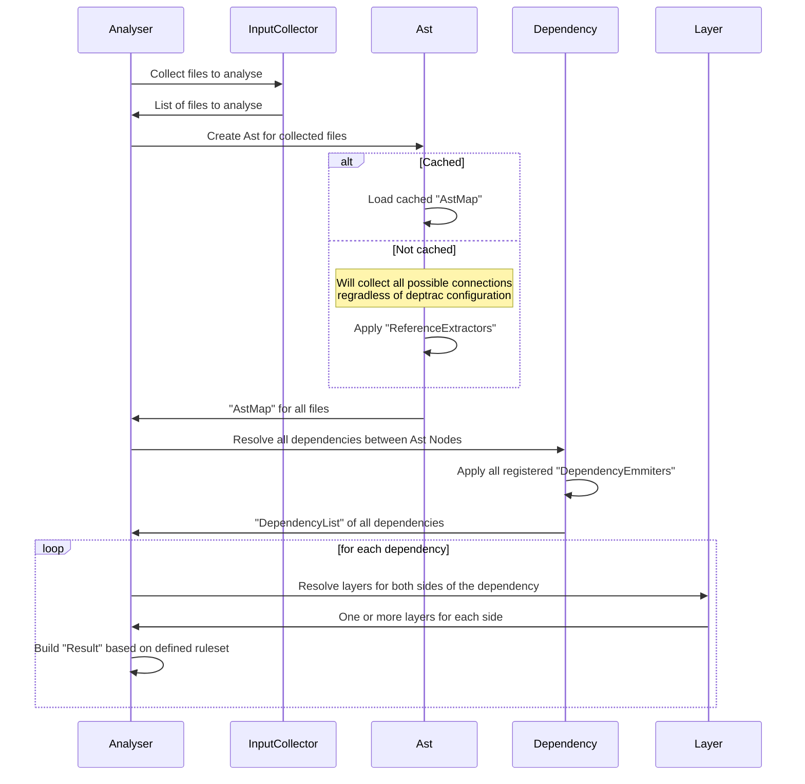

# Contributing to Deptrac

There are many ways to contribute to Deptrac, from helping others with their
issues, improving the documentation to fixing bugs & adding new features. The
maintainers and contributors will help you best as they can, when you have
questions or troubles. Feel free to reach out.

When you want to add a new feature to Deptrac, please make sure to open an issue
first to let others know who is working on it and prevent similar or conflicting
pull requests. We are always happy to expand the possibilities of Deptrac to
better fit the need of anyone who uses it. Before we merge changes, we have to
decide whether we can maintain them without taking away resources needed
elsewhere. Unfortunately, that means we have to reject some change requests.
Opening an issue before you start working on any new feature will make sure that
your merge request can be accepted.

## Requirements

- PHP in version 8.1 or above
- [Composer](https://getcomposer.org/)
- `make`

## Installing tools

You can install all tools needed for developing Deptrac using the Makefile by
running the following command:

```console
$ make composer-install
```

## Pipeline

Any merge request must pass our build pipeline which consists of the following:

* Unit Tests for all supported PHP-versions
* Check for coding guidelines
* Static code analysis with phpstan and psalm
* End 2 End-tests, ensuring `deptrac.phar` can be built

You can use the provided Makefile to execute these steps locally. The `make`
command is supported by most major operating systems, but you might need to
install it first. The Makefile will use Composer to install the required tools
like PHPUnit, Psalm or PHPStan. If you don't want to use Composer or the
Makefile you will need to install them yourself.

### Tests

You can run the unit tests locally using the provided Makefile

```
make tests
```

This will run phpunit to make sure the tests pass. We recommend running the
tests once before you make any changes to ensure they work on your system. This
way you can be sure that any failing test is not caused by a pre-existing
problem.

### Code style

You can check if your code changes are in line with our coding guidelines using
php-cs-fixer.

```
make php-cs-check
```

This will show you any code style violations that are also reported on Github.
You can automatically fix them by running:

```
make php-cs-fix
```

### Static code analysis

In order to perform static code analysis for your changes you can run:

```
make phpstan
make psalm
```

We also run a tool called infection for mutation testing:

```
make infection
```

### Build Deptrac

You can build the `deptrac.phar` both to ensure it works, as well as for using
it to analyse your existing projects to see if your changes work as expected.

```console
$ make build
```

This will create an executable file `deptrac.phar` in the current directory.

## Deptrac Engine (Internals)

The internal Deptrac engine consists of several parts, some of those can be influenced by configuration or extensions (`Analyser`, `InputCollector`, `Dependency`, `Layer`), while others cannot (`Ast`). To give you a brief overview of how the pieces lock together, a diagram of `DependencyLayerAnalyser` run:



### InputCollector

Is responsible for collecting all the files to be analysed. By default, it uses the [`deptrac.paths`](configuration.md#paths) section of the configuration to determine which files to collect and [`exclude_files`][depfile.md#exclude_files] to exclude filenames matching the specified patterns.

### Ast

The Ast module is responsible for parsing all the provided files and building an Abstract Syntax Tree (AST) for those files. The `AstLoader` fetches everything, even if you have configured Deptrac to ignore some parts of the file, e.g. because the class is not in any layer or you configured [`types`](configuration.md#types) to ignore certain things like use-statements. Filtering the found dependencies happens in the next phase.

The main part of the parsing is done in the `FileReferenceVisior`. This file is primarily concerned with keeping the appropriate scope (are you inside a class or a function) and also keeping track of currently applicable `@template` annotations. You can extend the functionality by adding extractors implementing the `ReferenceExtractorInterface` to build more connections between the nodes.

The result is an `AstMap` containing all occurrences of found files, classes and functions. This is what gets saved into the `.deptrac.cache` file.

### Dependency

The Dependency module is concerned with taking the generated `AstMap` and converting it into a `DependencyList` of applicable dependencies between nodes based on the [`deptrac.analyser.types`](configuration.md#types) section of the configuration.

Each type corresponds to an emitter implementing `DependencyEmitterInterface`.

### Layers

As the name suggests, this module resolves what layers should each token be a part of. It leverages the [collectors](collectors.md) defined in the [`deptrac.layers`](configuration.md#layers) section of the configuration.

### Analyser

The Analyser orchestrates between these modules. It calls the `InputCollector`, `Ast` and `Dependency` modules to generate a list of relevant dependencies matched to their layers, compares them against the [`deptrac.ruleset`](configuration.md#ruleset) section of the configuration and finally generates a `Result`, which will be returned in the output.

The `Result` is a collection of `Allowed`, `Error`, `Warning`, `Violation`, `Skipped` and `Uncovered` Rules. Those are then processed by the [`OutputFormatters`](formatters.md) to give you the desired output you can see when you call a command.
