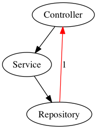
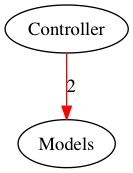

# Core concepts

At the heart of Deptrac are three main concepts:

* [**Layers**](#layers) are groups of classes that you define
* [**Rulesets**](#ruleset-allowing-dependencies) Describe whether which layers a
  layer can communicate with, i.e. which classes are allowed in that layer
* [**Violations**](#violations) show when a layer uses classes from another
  layer that is forbidden by the currently configured rulesets.

## Layers

Deptrac allows you to group different tokens(classes, function, file usage
outside those) into *layers*. Technically layers are nothing more than a
collection of those tokens.

Each layer has a unique name and a list of one or more collectors, which will
look for tokens should be assigned to this layer (and yes, tokens can be
assigned to more than one layer).

If you want to ensure your application follows the MVC architecture pattern then
you can create a config file that makes sure a View does not directly interact
with a Controller or that Models are independent of both Views and Controllers.

Another example for layers are bundles in Symfony applications. Each bundle
should be independent by design. You can create layers for each bundle you have
in your application and then ensure that they do not use tokens from any of the
other bundles. This is particularly helpful when you have an application with
many bundles as it will tell you which ones to consolidate and which ones can be
extracted and reused.

Deptrac allows you to visualize and enforce a ruleset based on such layer
information.

So you could define that every class that ends with `Controller` will be
assigned to the *Controller* layer, and every class that has `\Model\` in its
namespace will be added to the *Model* layer.

**By default, all dependencies between layers are forbidden!**

### Collecting Layers

If your application has *controllers* and *models*, Deptrac allows you to group
them into layers.

```yaml
deptrac:
  paths:
    - ./examples/ModelController
  exclude_files: ~
  layers:
    -
      name: Models
      collectors:
        -
          type: classLike
          value: .*MyNamespace\\Models\\.*
    -
      name: Controller
      collectors:
        -
          type: classLike
          value: .*MyNamespace\\.*Controller.*
  ruleset: [ ]
```

At first, lets take a closer look at the first layer (named *Models*).

Here we decided that our software has some kind of layer called *Models*. You
assign tokens to this layer with the help of [*Collectors*](collectors.md).

Collectors are responsible for taking a closer look at your code and decide if a
token is part of a layer. By using the `classLike` collector you can define a
regular expression for a class name. Every (fully qualified) class name that
matches this regular expression becomes part of the assigned layer. In this
example we define that every class that contains `MyNamespace\Models\` will be a
part of the *Model* layer.

Every class that matches `.*MyNamespace\\.*Controller.*` will become a part of
the *Controller* layer.

As we defined our layers, we can generate a dependency graph for the example
configuration:
(Make sure that [*Graphviz*](/#optional-dependency-graphviz) (dot) is
installed on your system)

```console
$ php deptrac.phar analyse --config-file=examples/ModelController1.depfile.yaml
```

After Deptrac has finished, an image should be opened:


On your command line Deptrac will produce this output:

```console
Start to create an AstMap for 2 Files.
..
AstMap created.
start emitting dependencies "InheritanceDependencyEmitter"
start emitting dependencies "BasicDependencyEmitter"
end emitting dependencies
start flatten dependencies
end flatten dependencies
collecting violations.
formatting dependencies.

Found 0 Violations
```

The output shows, that Deptrac is parsing 2 files and found 0 violations. By
default, every dependency between layers is a violation. In our case there are
(for now) no dependencies between our classes (layers). It's fine that Deptrac
will show us two independent layers without any relationship.

## Ruleset (Allowing Dependencies)

Allowed dependencies between layers are configured in a *ruleset*.

By default, Deptrac will raise a violation for every dependency between layers.
In real software you want to allow dependencies between different kinds of
layers.

As a lot of architectures define some kind of *controllers*, *services* and
*repositories*, a natural approach for this would be to define these rules:

- *Controllers* may access *services*, but not *repositories*.
- *Services* may access *repositories*, but not *controllers*.
- *Repositories* neither may access services nor *controllers*.

We can define this using the following configuration:

```yaml
# deptrac.yaml
deptrac:
  paths:
    - ./examples/ControllerServiceRepository1/
  exclude_files: ~
  layers:
    -
      name: Controller
      collectors:
        -
          type: classLike
          value: .*MyNamespace\\.*Controller.*
    -
      name: Repository
      collectors:
        -
          type: classLike
          value: .*MyNamespace\\.*Repository.*
    -
      name: Service
      collectors:
        -
          type: classLike
          value: .*MyNamespace\\.*Service.*
  ruleset:
    Controller:
      - Service
    Service:
      - Repository
    Repository: ~
```

Take a closer look at the ruleset. We allow the *Controller* layer to access
*Service* and *Service* can access *Repository*, but *Repository* may not access
any of the two other layers.

After running Deptrac we will get this result:



```console
Start to create an AstMap for 3 Files.
...
AstMap created.
start emitting dependencies "InheritanceDependencyEmitter"
start emitting dependencies "BasicDependencyEmitter"
end emitting dependencies
start flatten dependencies
end flatten dependencies
collecting violations.
formatting dependencies.
examples\MyNamespace\Repository\SomeRepository::5 must not depend on examples\MyNamespace\Controllers\SomeController (Repository on Controller)
```

Deptrac now finds a violation. If we take a closer look at the "SomeRepository"
on line 5, we will see an unused use statement for a controller:

```php
namespace examples\MyNamespace\Repository;

use examples\MyNamespace\Controllers\SomeController;

class SomeRepository { }
```

If we remove the `use` statement and rerun Deptrac, the violation will
disappear.

### Different Layers and Different Views

In the example above we defined 3 different layers (*controller*, *repository*
and *service*). Deptrac gives architects the power to define what kind of layers
exist.

Typical use cases are:

- caring about layers in different architectures (tier, hexagonal, ddd, ...)
- caring about dependencies between different kinds of services (infrastructure
  services / domain services / entities / DTOs / ...)
- caring about coupling to third party code like composer vendors, frameworks,
  ...
- enforcing naming conventions
- ...

Typically software has more than just one view. **It is possible to use multiple
config files, to take care about different architectural views.**

### Uncovered dependencies

Deptrac collects uncovered dependencies which can be reported with the
[Console Formatter](/docs/formatters.md). By default, internal php classes will
not be considered. This can be changed by
adding `ignore_uncovered_internal_classes: false` to your configuration.

You can use the `--fail-on-uncovered` option to let Deptrac fail when any
uncovered dependencies are encountered.

You can use the `--report-uncovered` option to let you know about any uncovered
dependencies in the report that is generated by Deptrac.

### @internal and @deptrac-internal annotation

You can mark your classes with `@internal` or `@deptrac-internal` annotation. If you do so, the marked class cannot be referenced by any class outside its layer. This will supersede any ruleset configuration you might have defined. This way, you don't have to define 2 separate layers to distinguish between layers external API and its private implementation.

## Violations

If we have 2 layers (*Models*, *Controller*) and one layer is using the other,
Deptrac will raise a violation by default:

```php
// see the example in examples/ModelController2
namespace examples\MyNamespace\Controllers;

use examples\MyNamespace\Models\SomeModel;

class SomeController
{
    public function foo(SomeModel $m) {
        return $m;
    }
}
```

After running Deptrac for this example

```console
$ php deptrac.phar analyse --config-file=examples/ModelController2.depfile.yaml
```

we will get this output:

```console
Start to create an AstMap for 2 Files.
..
AstMap created.
start emitting dependencies "InheritanceDependencyEmitter"
start emitting dependencies "BasicDependencyEmitter"
end emitting dependencies
start flatten dependencies
end flatten dependencies
collecting violations.
formatting dependencies.
examples\MyNamespace\Controllers\SomeController::5 must not depend on examples\MyNamespace\Models\SomeModel (Controller on Models)
examples\MyNamespace\Controllers\SomeController::9 must not depend on examples\MyNamespace\Models\SomeModel (Controller on Models)

Found 2 Violations
```



Deptrac has found two violations because the relation from the controller to
model layers is not allowed. The console output shows exactly the lines Deptrac
found.

### Skip violations

Deptrac integration into existing CI/CD pipeline might be difficult because of
existing dependency violations in the code. In this case, you can skip existing
violations to gradually improve your code and avoid possibility introduce any
new violations.

Violations can be skipped by provided list of dependencies in *skip_violations*
configuration section:

```yaml
deptrac:
  skip_violations:
    Library\LibClass:
      - Core\CoreClass
```

*skip_violations* section contains an associative array where a
key (`Library\LibClass`) is the name of dependent token and
values (`Core\CoreClass`) are dependency tokens.

Matched violations will be marked as skipped:

```console
$ php deptrac.phar analyse --config-file=examples/SkipViolations.yaml --report-skipped
1/1 [▓▓▓▓▓▓▓▓▓▓▓▓▓▓▓▓▓▓▓▓▓▓▓▓▓▓▓▓] 100%

[SKIPPED] Library\LibClass must not depend on Core\CoreClass (Library on Core)
/path/examples/SkipViolations/SkipViolations.php::11

[ERROR] Skipped violation "Core\Unmatched" for "Library\LibClass" was not matched.

Report:
Violations: 0
Skipped violations: 1
Uncovered: 0
Allowed: 1
```
