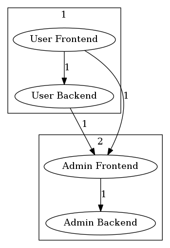

# Formatters

Deptrac has support for different output formatters with various options.

You can get a list of available formatters by running,

```bash
php deptrac.php analyse --help
```

*Hint*: Symfony Console does not allow to pass options to the default command.
Therefore in order to use the formatter options you have to explicitly use
the `analyse` command as shown above.

* [Baseline Formatter](#baseline-formatter)
* [Console Formatter](#console-formatter)
* [GitHubActions Formatter](#githubactions-formatter)
* [Graphviz Formatter](#graphviz-formatter)
  * [Hide layers in output](#hide-layers-in-output)
  * [Group layers](#group-layers)
* [JSON Formatter](#json-formatter)
* [JUnit Formatter](#junit-formatter)
* [Table Formatter](#table-formatter)

## Baseline Formatter

The Baseline formatter is a console formater, which generates
the `skip_violations` section to the given File. With this formatter it's
possible to start on a project with some violations without a failing CI Build.

*Note*: It's not the best solution to ignore all the errors because maybe your
current Architecture doesn't allow a change without a new violation.

It can be activated with `--formatter=baseline`.

Supported options:

```
--baseline-dump[=BASELINE-DUMP] path to a dumped baseline file [default: "./depfile.baseline.yml"]
```

Include the baseline into your existing `depfile.yml`

```yaml
# depfile.yml
baseline: depfile.baseline.yml
```

## Console Formatter

The default formatter is the console formatter, which dumps basic information
to *STDOUT*,

```
examples\MyNamespace\Repository\SomeRepository::5 must not depend on examples\MyNamespace\Controllers\SomeController (Repository on Controller)
```

## GitHubActions Formatter

The GithubActions formatter is a console formater, which dumps basic information
in github-actions format to *STDOUT*. This formatter is enabled by default while
running in a github actions environment. It can be activated manually
with `--formatter=github-actions`.

```
::error file=/home/testuser/originalA.php,line=12::ACME\OriginalA must not depend on ACME\OriginalB (LayerA on LayerB)
```

## Graphviz Formatter

The Graphviz formatter is disabled by default. It can be activated
with `--formatter=graphviz`. Deptrac automatically tries to open the image
generated by Graphviz. You can disable automatic opening of the image by setting
the `--graphviz-display=false` option, which is useful on CI-servers.

Supported options:

```
--graphviz-display=           should try to open graphviz image [default: true]
--graphviz-dump-image=        path to a dumped png file [default: ""]
--graphviz-dump-dot=          path to a dumped dot file [default: ""]
--graphviz-dump-html=         path to a dumped html file [default: ""]
```

*Hint*: You can create an image, a dot and an HTML file at the same time.

#### Hide layers in output

Under `formatters.graphviz.hidden_layers` you can define a list of `layers` you
do not want to include when using the corresponding `graphviz` output formatter.
The generated image will not contain these layers, but they will be part of the
analysis.

There are 2 main use-cases for this feature:

- Hiding a generic/general domains like the `vendor` folder
- Having multiple "views" for your architecture. You can define a shared file
  with all your `layers` and a `ruleset` and then have multiple config files for
  the different `hidden_layers`. Using the `graphviz` formatter with these files
  will then generate graphs focusing on only the relevant layers.

```yaml
layers:
  -
    name: Utils
    collectors:
      -
        type: className
        regex: .*Util.*
  -
    name: Controller
    collectors:
      -
        type: className
        regex: .*Controller.*
ruleset:
  Controller:
    - Utils
formatters:
  graphviz:
    hidden_layers:
      - Utils
```

#### Group layers

Another supported option is `formatters.graphviz.groups`. There you can sort
layers into groups that will be rendered as sub-graphs in GraphViz output.

The following config:

```yaml
layers:
  - User Frontend
  - User Backend
  - Admin Frontend
  - Admin Backend
formatters:
  graphviz:
    groups:
      User:
        - User Frontend
        - User Backend
      Admin:
        - Admin Frontend
        - Admin Backend
```

Will produce the following graph:



## JSON Formatter

By default, Json formatter dumps information to *STDOUT*. It can be activated
with `--formatter=json`

```json
{
  "Report": {
    "Violations": 1,
    "Skipped violations": 2,
    "Uncovered": 1,
    "Allowed": 0,
    "Warnings": 0,
    "Errors": 0
  },
  "files": {
    "src/ClassA.php": {
      "violations": 2,
      "messages": [
        {
          "message": "ClassA must not depend on ClassB (LayerA on LayerB)",
          "line": 12,
          "type": "error"
        },
        {
          "message": "ClassA should not depend on ClassC (LayerA on LayerB)",
          "line": 15,
          "type": "warning"
        }
      ]
    },
    "src/ClassC.php": {
      "violations": 1,
      "messages": [
        {
          "message": "ClassC should not depend on ClassD (LayerA on LayerB)",
          "line": 10,
          "type": "warning"
        }
      ]
    },
    "src/OriginalA.php": {
      "violations": 1,
      "messages": [
        {
          "message": "OriginalA has uncovered dependency on OriginalB (LayerA)",
          "line": 5,
          "type": "warning"
        }
      ]
    }
  }
}
```

Supported options:

```
--json-dump= path to a dumped json file
```

## JUnit Formatter

The JUnit formatter dumps a JUnit Report XML file, which is quite handy in CI
environments. It is disabled by default, to activate the formatter just
use `--formatter=junit`.

```xml
<?xml version="1.0" encoding="UTF-8"?>
<testsuites>
    <testsuite id="1"
        package=""
        name="Controller"
        timestamp="2018-06-07T10:09:34+00:00"
        hostname="localhost"
        tests="3"
        failures="2"
        errors="0"
        time="0">
        <testcase name="Controller-examples\Layer1\AnotherClassLikeAController"
            classname="examples\Layer1\AnotherClassLikeAController"
            time="0">
            <failure message="examples\Layer1\AnotherClassLikeAController:5 must not depend on examples\Layer2\SomeOtherClass (Controller on Layer2)"
                type="WARNING" />
            <failure message="examples\Layer1\AnotherClassLikeAController:23 must not depend on examples\Layer2\SomeOtherClass (Controller on Layer2)"
                type="WARNING" />
        </testcase>
    </testsuite>
    <testsuite id="2"
        package=""
        name="Layer2"
        timestamp="2018-06-07T10:09:34+00:00"
        hostname="localhost"
        tests="3"
        failures="4"
        errors="0"
        time="0">
        <testcase name="Layer2-examples\Layer2\SomeOtherClass2"
            classname="examples\Layer2\SomeOtherClass2"
            time="0">
            <failure message="examples\Layer2\SomeOtherClass2:5 must not depend on examples\Layer1\SomeClass2 (Layer2 on Layer1)"
                type="WARNING" />
            <failure message="examples\Layer2\SomeOtherClass2:17 must not depend on examples\Layer1\SomeClass2 (Layer2 on Layer1)"
                type="WARNING" />
        </testcase>
        <testcase name="Layer2-examples\Layer2\SomeOtherClass"
            classname="examples\Layer2\SomeOtherClass"
            time="0">
            <failure message="examples\Layer2\SomeOtherClass:5 must not depend on examples\Layer1\SomeClass (Layer2 on Layer1)"
                type="WARNING" />
            <failure message="examples\Layer2\SomeOtherClass:17 must not depend on examples\Layer1\SomeClass (Layer2 on Layer1)"
                type="WARNING" />
        </testcase>
    </testsuite>
</testsuites>
```

Supported options:

```
--junit-dump-xml=     path to a dumped xml file [default: "./junit-report.xml"]
```

## Table Formatter

The table formatter groups results by layers to its own table. It can be
activated with `--formatter=table`.
