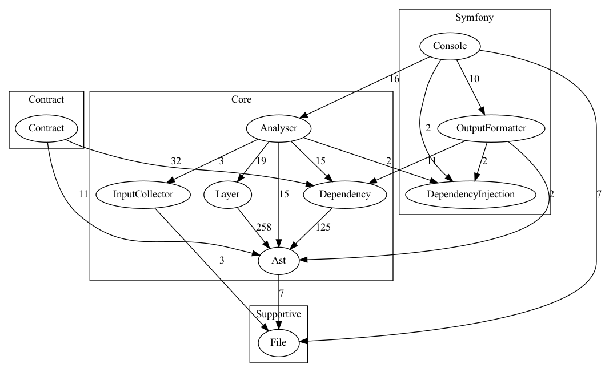

## What is Deptrac?

Deptrac is a static code analysis tool for PHP that helps you communicate,
visualize and enforce architectural decisions in your projects. You can freely
define your architectural layers over classes and which rules should apply to
them.

For example, you can use Deptrac to ensure that bundles/modules/extensions in
your project are truly independent of each other to make them easier to reuse.

Deptrac can be used in a CI pipeline to make sure a pull request does not
violate any of the architectural rules you defined. With the optional Graphviz
formatter you can visualize your layers, rules and violations.



## Requirements

In order to run Deptrac you need at least PHP 8.1.

You can analyse projects that require an older PHP version as long as
[nikic/php-parser](https://github.com/nikic/PHP-Parser) can parse it.

## Installation

You can install Deptrac via Composer. We recommend using the [deptrac-shim](https://github.com/qossmic/deptrac-shim) package for this.
Alternatively, you can also use [PHIVE](#phive) or download the
[PHAR](#phar) attached to each release on GitHub.  
This will ensure that Deptrac and its dependencies are
bundled together and will not interfere with any of your project's dependencies.

### Composer

We strongly advise against using the deptrac package directly as a composer dependency. 
We update dependencies regularly, which might cause disruptions in your project.  
Instead, please use the dedicated distribution repository <https://github.com/qossmic/deptrac-shim>.

When you install Deptrac using the qossmic/deptrac-shim package, you will get
the benefit of using the phar installation, but you can use it like any other
composer dependency, i.e. you run Deptrac like this:

```bash
composer require --dev qossmic/deptrac-shim
vendor/bin/deptrac analyse
```

### PHAR

Download the latest [deptrac.phar](https://github.com/qossmic/deptrac/releases).

You can run the phar file using php:

```bash
php deptrac.phar analyse
```

All examples in this documentation, assume you have the deptrac.phar downloaded
in your project's root directory as described above.

Feel free to add Deptrac to your PATH (i.e. `/usr/local/bin/deptrac`) to make it
globally available.

```bash
curl -LS https://github.com/qossmic/deptrac/releases/download/1.0.2/deptrac.phar -o deptrac.phar

# optional
sudo chmod +x deptrac.phar
sudo mv deptrac.phar /usr/local/bin/deptrac
```

### PHIVE

You can install Deptrac with [Phive](https://phar.io/#Install)

`phive install -g qossmic/deptrac`

and accept the key with fingerprint
`41DD E075 4745 9FAE CFA1  7813 B8F6 4013 4AB1 782E`.

To upgrade Deptrac use the following command:

`phive update -g qossmic/deptrac`

### Optional Dependency: Graphviz

If you want to create graphical diagrams with your class dependencies, you will
also need the `dot` command provided by [Graphviz](http://www.graphviz.org/).

Graphviz can be installed using common package managers:

```bash
# for macos + brew
brew install graphviz

# for ubuntu and debian
sudo apt-get install graphviz
```

Graphviz is also available for
[Windows](https://graphviz.gitlab.io/_pages/Download/Download_windows.html).
Install the current stable release and append the binary path on the environment
variable Path (e.g. ``C:\Program Files (x86)\Graphviz2.38\bin``).

## Getting Started

In order to get started with Deptrac you will need a configuration file.
This configuration file is written in YAML and, by default, is stored with the
name `deptrac.yaml` in your project's root directory.

Deptrac can generate a template for you, using the `init` command.

```bash
php deptrac.phar init
```

The main purpose of this file is:

1. Define in which directories Deptrac will search for classes and which files
   to exclude.
2. Define your architectural layers using so-called collectors.
3. Define a ruleset describing which layers can communicate with each other.

You can find out more about the [Core Concepts](concepts.md) in the docs.

### Configuration

Let's have a look at the generated file:

```yaml
# deptrac.yaml
deptrac:
  paths:
    - ./src
  exclude_files:
    - '#.*test.*#'
  layers:
    -
      name: Controller
      collectors:
        -
          type: className
          value: .*Controller.*
    -
      name: Repository
      collectors:
        -
          type: className
          value: .*Repository.*
    -
      name: Service
      collectors:
        -
          type: className
          value: .*Service.*
  ruleset:
    Controller:
      - Service
    Service:
      - Repository
    Repository: ~
```

By default, Deptrac will search your project's `src/` directory for classes and
will ignore any files and directory having `test` in it.

We then define three layers by searching for class names in the files found by
Deptrac. Any file containing a class with `Controller` will be grouped in a
layer with the same name. The same happens for classes having `Repository` and
`Service` in their name. It is important to note that the fully qualified class
name is used for grouping classes. That means, the collector will take the full
namespace with class name into account.

The default ruleset will then allow classes in the Controller-layer to
communicate - i.e. use classes from - the Service layer. Classes grouped in the
Service layer may not use classes from the Controller layer, but they can use
classes from the Repository layer. Classes inside the Repository layer may not
use any classes from the other two layers.

You can learn more about the file in the [Configuration reference](configuration.md).

## Run Deptrac

Once you have set up the config file you can run Deptrac to analyse your code
and check for violations. If you use the default configuration file, you can
type `php deptrac.phar`, otherwise you will need to specify which command and
config file should be used.

```bash
php deptrac.phar

# which is equivalent to
php deptrac.phar analyse --config-file=deptrac.yaml
```

If you run `php deptrac.phar -v` you'll get a more verbose output.

The analyse command runs with a caching mechanism for parsed files by default.
This can be disabled with the `--no-cache` option.

The generated output will roughly look like this:

```bash
 ----------- --------------------------------------------------------------------------------------------------------------------------------
  Reason      Repository
 ----------- --------------------------------------------------------------------------------------------------------------------------------
  Violation   examples\MyNamespace\Repository\SomeRepository must not depend on examples\MyNamespace\Controllers\SomeController (Controller)
              /Users/dbr/workspace/qossmic/deptrac/examples/ControllerServiceRepository1/SomeRepository.php:5
 ----------- --------------------------------------------------------------------------------------------------------------------------------


 -------------------- -----
  Report
 -------------------- -----
  Violations           1
  Skipped violations   0
  Uncovered            0
  Allowed              4
  Warnings             0
  Errors               0
 -------------------- -----
```

This is a report generated by Deptrac. At the top you can see a list of
violations, if there are any. A violation means, that a layer uses a layer that
is prohibited by the configured ruleset. In this case, a class from the
Repository layer uses a class from the Controller layer.

The table on the bottom gives you an overview over:

* how many violations were found.
* how many violations were skipped, meaning your config contains exceptions.
  which will not cause Deptrac to return with an error status code, e.g. in CI,
  when these violations are found.
* how many classes were found in the directories, that were not assigned to a
  layer.
* how many usages between layers were found that do not violate the ruleset.
* how many warnings where encountered, e.g. because a class is grouped in
  multiple layers.
* how many errors were encountered, e.g. when you exclude a violation in your
  config file but that violation is not encountered.

If the output does not match your expectations please take a look at
[the debugging commands](debugging.md) available in Deptrac.

You can also change the output format itself by using one of the many provided
[Output Formatters](formatters.md).

## Contribute

Deptrac is in active development. We are looking for your suggestions and help
to make it better.

Feel free to **open an issue** if you encounter bugs, have suggestions or
would like to add a new feature to Deptrac.

Please feel free to improve this documentation, fix bugs, or work on a suggested
feature by making a pull request on GitHub. Don't hesitate to ask for support,
if you need help at any point.

The [Contribution Guide](CONTRIBUTING.md) in the documentation contains
some advice for making a pull request with code changes.

### Code of Conduct

If you are **professional** and **polite** then everything will be alright.

Please don't be inconsiderate or mean, or anything in between.

## Further Documentation

* [Backwards Compatibility](bc_policy.md) - General info on how we approach
  backwards compatibility
* [Upgrade Guide](upgrade.md) - List of backwards breaking changes that need to
  be addressed when upgrading Deptrac to a new version and how to do it.
* [Core Concepts](concepts.md) - Explains layers, rules and violations in
  more details.
* [Configuration](configuration.md) - Reference for all available settings in a
  config file
* [Collectors](collectors.md) - Reference for which collectors are
  available in Deptrac to define your layers.
* [Formatters](formatters.md) - Lists the different output formats
  supported by Deptrac
* [Debugging](debugging.md) - Overview of the debug commands
* [Code Of Conduct](CODE_OF_CONDUCT.md) - Our community standards
* [Contribute](CONTRIBUTING.md) - Advice for contributing code changes,
  e.g. how to run tests or how to build a phar file with your changes that you
  can use to analyse your projects
* [Security Guide](SECURITY.md) - How to report security vulnerabilities
